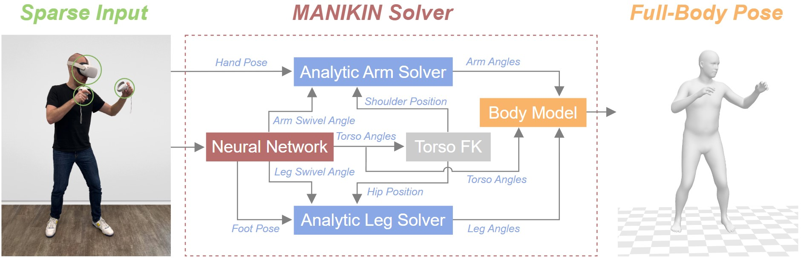

<div align="center">

# MANIKIN: Biomechanically Accurate Neural Inverse Kinematics for Human Motion Estimation

**ECCV 2024**

[Jiaxi Jiang](https://www.jiaxi-jiang.com/), [Paul Streli](https://www.paulstreli.com), [Xuejing Luo](https://drlxj.github.io/), [Christoph Gebhardt](https://ait.ethz.ch/people/cgebhard), [Christian Holz](https://www.christianholz.net)<br/>

ETH Zürich<br/>

</div>


<p align="center">
<a href="https://siplab.org/projects/MANIKIN"></a>
<a href="https://static.siplab.org/papers/eccv2024-manikin.pdf"></a>
</p>

___________

<p align="center">

</p>

**Left:** the input, i.e. the 6-DoF poses of the head and both hands.
**Middle:** the full-body motion estimated by MANIKIN, shown as the SMPL mesh with an anatomical skeleton inside.
**Right:** the same motion on a Unitree G1 humanoid, retargeted in closed form by carrying each limb's swivel angle over
to the robot.
**Below:** the swivel and joint angles of the arms (top row) and legs (bottom row), right side solid, left side dashed.

>Mixed Reality systems aim to estimate a user’s full-body joint configurations from just the pose of the end effectors, primarily head and hand poses. Existing methods often involve solving inverse kinematics (IK) to obtain the full skeleton from just these sparse observations, usually directly optimizing the joint angle parameters of a human skeleton. Since this accumulates error through the kinematic tree, predicted end effector poses fail to align with the provided input pose. This leads to discrepancies between the predicted and the actual hand positions or feet that penetrate the ground. In this paper, we first refine the commonly used SMPL parametric model by embedding anatomical constraints that reduce the degrees of freedom for specific parameters to more closely mirror human biomechanics. This ensures that our model produces physically plausible pose predictions. We then propose a biomechanically accurate neural inverse kinematics solver (MANIKIN) for full-body motion tracking. MANIKIN is based on swivel angle prediction and perfectly matches input poses while avoiding ground penetration. We evaluate MANIKIN in extensive experiments on motion capture datasets and demonstrate that our method surpasses the state of the art in quantitative and qualitative results at fast inference speed. Beyond pose estimation, MANIKIN lets users drive virtual avatars directly from the head and hand tracking of MR devices. Its swivel-angle limb parameterization also carries over to humanoid robots: the same swivel angles retarget the estimated motion to a Unitree G1, as shown above.

## Method

<p align="center">

</p>

Given the 6D poses of the head and hands as input, the neural network predicts the body's global orientation,
the local poses of the torso joints, the foot pose, and the swivel angle of each arm and leg. Forward kinematics on
the torso angles gives the shoulder and hip positions (Torso FK). The Analytic Arm/Leg Solver then computes the limb
angles in closed form from each limb's swivel angle and base joint position, so the hands match the input exactly.

## Installation

```bash
conda env create -f environment.yaml
conda activate manikin
```

Download the extended [SMPL+H](https://mano.is.tue.mpg.de/) model and the [DMPLs](https://smpl.is.tue.mpg.de/) (the body
models used by AMASS) from their websites and place them as

```
support_data/body_models/smplh/{male,female,neutral}/model.npz
support_data/body_models/dmpls/{male,female,neutral}/model.npz
```

## Repository layout

```
main_train.py            training entry point (both backbones; the config's `model` field selects it)
main_test.py             evaluation entry point
prepare_data.py          AMASS -> pickle preprocessing
data/                    MANIKIN-S / MANIKIN-L datasets + selector
models/                  model classes + base + selector + losses
networks/                manikin_s, manikin_l, swivel (swivel geometry + Analytic Arm/Leg Solver)
utils/                   options, transforms, metrics, logging helpers
options/                 configs for the reported results
model_zoo/               final checkpoints (downloaded separately, see Evaluation)
tools/                   SMPL -> biomechanical model conversion, visualization, G1 retargeting
```

## Data preparation

Download `CMU`, `BMLrub` and `HDM05` from [AMASS](https://amass.is.tue.mpg.de/) (SMPL+H G), then:

```bash
python prepare_data.py --root <AMASS root>        # -> datasets/<dataset>/{train,test}/*.pkl
```

The train/test split is read from `datasets/data_split/`.

## Training

```bash
# MANIKIN-S
python main_train.py -opt options/manikin_s_amass.yaml

# MANIKIN-L
python main_train.py -opt options/manikin_l_amass.yaml --benchmark amass_mixed
```

For the cross-dataset protocol (train on two datasets, test on the held-out one), MANIKIN-S uses
`options/manikin_s_cross_{cmu,bml,hdm05}.yaml` and MANIKIN-L uses `--benchmark cross_{cmu,bml,hdm05}`.
Checkpoints and logs are written under `results/<task>/`.

## Evaluation

Download the final checkpoints from **[Google Drive](https://drive.google.com/drive/folders/1Wf7GonLHeSJFJd5ioXDx2PgIDBknt9NW?usp=sharing)**
and place the `.pth` files under `model_zoo/`:

| eval set | MANIKIN-S | MANIKIN-L |
| --- | --- | --- |
| mixed | `manikin_s_amass.pth` | `manikin_l_amass.pth` |
| hold-out CMU | `manikin_s_cross_cmu.pth` | `manikin_l_cross_cmu.pth` |
| hold-out BML | `manikin_s_cross_bml.pth` | `manikin_l_cross_bml.pth` |
| hold-out HDM05 | `manikin_s_cross_hdm05.pth` | `manikin_l_cross_hdm05.pth` |

```bash
# MANIKIN-S
python main_test.py -opt options/manikin_s_amass.yaml --checkpoint model_zoo/manikin_s_amass.pth --gpu 0

# MANIKIN-L
python main_test.py -opt options/manikin_l_amass_eval_online.yaml --checkpoint model_zoo/manikin_l_amass.pth --gpu 0 --benchmark amass_mixed
```

MANIKIN-LN (non-causal, seq2seq) uses the same checkpoint with `options/manikin_l_amass_eval_s2s.yaml`. For the cross-dataset
checkpoints, use the matching `manikin_s_cross_*.yaml` or `--benchmark cross_*`.

Add `--save_pred` to write the predicted motion of each test sequence to `results/<task>/pred_npz/` in the AMASS npz
format, which the tools below take as input.

## Biomechanical conversion and humanoid retargeting

```bash
python tools/smpl2biomech.py --input <npz file or dir> --out <out dir>                  # 7-DoF limbs + joint angles
python tools/retarget_g1.py --input <out npz or dir> --g1_xml <mujoco_menagerie>/unitree_g1/g1.xml --out <g1 dir>
python tools/visualize.py --input <out npz> --out angles.png                            # swivel + joint angle curves
python tools/visualize.py --input <out npz> --out video.mp4 --blender <blender> \
    [--g1 <g1 npz> --g1_xml <mujoco_menagerie>/unitree_g1/g1.xml]                       # body (+ G1), curves below
```

`smpl2biomech.py` converts the arms and legs of SMPL-H motion (AMASS or MANIKIN predictions) to the anatomical
DoF model and adds the swivel angles and joint angles (see the script's docstring). Its output keeps the AMASS npz
format.

`retarget_g1.py` maps that output to the Unitree G1 humanoid (29 DoF) in closed form: each limb's swivel angle is
carried over to the robot and its joint angles follow analytically, without iterative IK. It writes the MuJoCo `qpos`
of every frame. It needs `pip install mujoco` and the G1 model from
[MuJoCo Menagerie](https://github.com/google-deepmind/mujoco_menagerie/tree/main/unitree_g1).

`visualize.py` plots the swivel and joint angles over time, or renders a video of the body (see-through, with an
anatomical skeleton inside) and, with `--g1`, the retargeted G1 next to it, with the curves below. The video is
rendered with [Blender](https://www.blender.org/) (tested with 4.2); `blender --python tools/view_blender.py -- --input
<out npz>` opens the scene in Blender.

## Citation

```bibtex
@inproceedings{jiang2024manikin,
  title={{MANIKIN}: Biomechanically Accurate Neural Inverse Kinematics for Human Motion Estimation},
  author={Jiang, Jiaxi and Streli, Paul and Luo, Xuejing and Gebhardt, Christoph and Holz, Christian},
  booktitle={European Conference on Computer Vision (ECCV)},
  pages={128--146},
  year={2024},
  organization={Springer},
  doi={10.1007/978-3-031-72627-9_8}
}
```

## Acknowledgements

This code builds on [EgoPoser](https://github.com/eth-siplab/EgoPoser) and
[AvatarPoser](https://github.com/eth-siplab/AvatarPoser). The MANIKIN-L backbone follows
[AvatarJLM](https://github.com/zxz267/AvatarJLM) and its spatial-temporal transformer
[MixSTE](https://github.com/JinluZhang1126/MixSTE). We train and evaluate on
[AMASS](https://amass.is.tue.mpg.de/) and use the [SMPL-H](https://mano.is.tue.mpg.de/) body model through
[human_body_prior](https://github.com/nghorbani/human_body_prior). The skeleton in the visualization is from
[BodyParts3D](https://dbarchive.biosciencedbc.jp/en/bodyparts3d/desc.html) (see `tools/assets/README.md`). We thank
the authors of these projects for releasing their code, models, and data.
